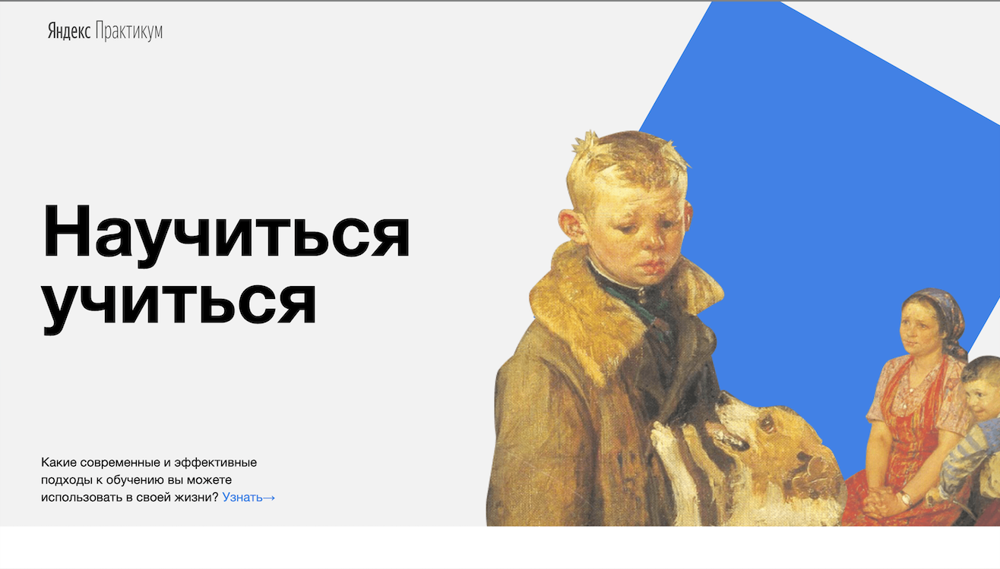

# How to Learn 
------------------

[Ссылка на страницу](https://thebarbakov.github.io/how-to-learn/)
***

Доработка проектной работы How to learn. Страница о том, как необходимо учиться. 
***
## Изменения:
1. Была переофрмлена файловая структура проекта по правилам Nested БЭМ.
2. Добавление CSS анимаций для фигур в блоке: **Footer**, **Kaufman**.
3. Были добавлены блоки: **Techniques**, **Video**, **Oakley**, **Khan**, **Resources**.
4. Все ссылки на странице при наведении мыши теперь становятся немного прозрачными.
***
## Использованные технологии:
* HTML 5.3
* CSS3
***
## Планы по доработке проекта
1. Подключить другие шрифты со сторнних ресурсов, с помощью CSS, для улучшение дизайна страницы.
2. Дописать все вендорные префиксы в CSS, для максимальной кроссбраузерности страницы.
3. Задизайнить форму, через которую пользователи смогут отправить комментарии, для того, чтобы получать обратную связь от страницы.

